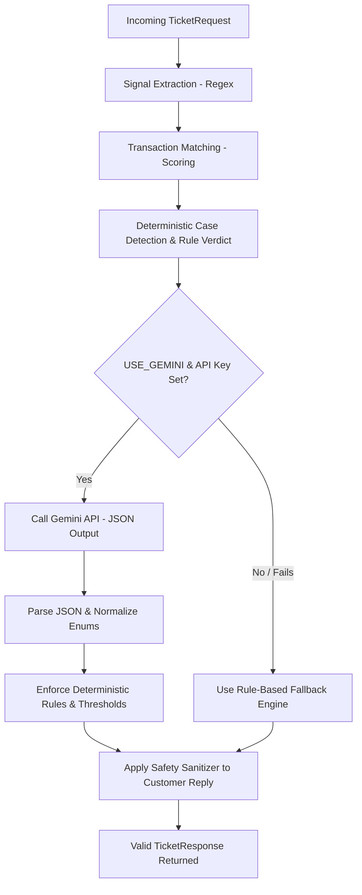

# QueueStorm Investigator ⚡🔍

> **Internal Support Copilot for Digital Finance Complaints**
> Developed for SUST CSE Carnival 2026 Codex Community Hackathon.

---

## 📖 Project Overview

QueueStorm Investigator is an AI-powered financial complaint investigator and router. It acts as an **internal support copilot** that analyzes user tickets alongside their transaction history to:
1. Detect the core issue (case classification).
2. Match complaints against transaction records.
3. Determine if evidence supports or refutes the claim (evidence verdict).
4. Assign severity levels and route cases to the correct internal department.
5. Draft safe, compliant customer replies and recommended next actions.

The system utilizes a dual-engine architecture: a deterministic rules-based engine for high-reliability matching/safety, and the Gemini API for advanced reasoning, Bangla/Banglish processing, and summary generation.

---

## 🛠️ Tech Stack

- **Core Framework**: FastAPI, Python 3.11+
- **Validation**: Pydantic v2
- **Server**: Uvicorn
- **AI Integration**: Gemini API (supporting new `google-genai` and legacy `google-generativeai` SDKs)
- **Environment Management**: python-dotenv
- **Testing**: pytest

---

## ⚙️ Environment Variables

Copy `.env.example` to `.env` and fill in the required keys:

```bash
cp .env.example .env
```

| Variable | Description | Default |
| :--- | :--- | :--- |
| `GEMINI_API_KEY` | Google Gemini API Key | Required for AI engine |
| `GEMINI_MODEL` | Gemini Model to target | `gemini-1.5-flash` |
| `GEMINI_TIMEOUT_SECONDS` | Timeout duration for LLM calls | `12` |
| `USE_GEMINI` | Feature flag to enable/disable AI reasoning | `true` |

---

## 🚀 Running Locally

1. **Clone the repository and install dependencies**:
   ```bash
   pip install -r requirements.txt
   ```

2. **Run the development server**:
   ```bash
   uvicorn app.main:app --reload
   ```
   The API will be available at `http://127.0.0.1:8000`.

3. **Run unit tests**:
   ```bash
   pytest
   ```

---

## 📡 API Endpoints

### 1. Health Check
* **Endpoint**: `GET /health`
* **Description**: Verifies that the service is running. It is fast and does not depend on external APIs (Gemini).
* **Response**:
  ```json
  {
    "status": "ok"
  }
  ```

### 2. Analyze Ticket
* **Endpoint**: `POST /analyze-ticket`
* **Description**: Validates, parses, and investigates complaints against transaction history.
* **Request Schema**:
  ```json
  {
    "ticket_id": "TKT-001",
    "complaint": "I sent 5000 taka to a wrong number around 2pm today...",
    "language": "en",
    "channel": "in_app_chat",
    "user_type": "customer",
    "campaign_context": null,
    "transaction_history": [
      {
        "transaction_id": "TXN-9101",
        "timestamp": "2026-04-14T14:08:22Z",
        "type": "transfer",
        "amount": 5000,
        "counterparty": "+8801719876543",
        "status": "completed"
      }
    ]
  }
  ```
* **Response Schema**:
  ```json
  {
    "ticket_id": "TKT-001",
    "relevant_transaction_id": "TXN-9101",
    "evidence_verdict": "consistent",
    "case_type": "wrong_transfer",
    "severity": "high",
    "department": "dispute_resolution",
    "agent_summary": "Customer reports sending 5000 BDT to a wrong recipient, and the transaction history contains a matching completed transfer.",
    "recommended_next_action": "Verify wrong transfer details and escalate to dispute resolution for holding/reversal.",
    "customer_reply": "We have noted your wrong transfer concern. Please do not share your PIN, OTP, or password with anyone. Our dispute resolution team is investigating the target account and transaction status.",
    "human_review_required": true,
    "confidence": 0.9,
    "reason_codes": [
      "wrong_transfer",
      "transaction_match"
    ]
  }
  ```

---

## 🧠 AI & Analytical Core

### Core Analysis Pipeline Flow



### AI Approach
We leverage Gemini to extract semantic signals, understand complex multi-lingual context (Bangla and Banglish), and formulate professional agent summaries and replies. We utilize structured JSON mode to guarantee valid schemas.

### Evidence Reasoning
Before making a decision, the engine correlates complaint facts against transaction histories.
1. **Signal Extraction**: Extracts monetary amounts, phone numbers (e.g., `017xxxxxxxx`), and transaction IDs.
2. **Transaction Scoring**:
   - Exact transaction ID match: `+100` points
   - Amount matches: `+40` points
   - Counterparty / Phone matches: `+40` points
   - Minimum Threshold: `40` points required to confirm a match.
3. **Verdict Logic**:
   - **`consistent`**: Transaction data matches and supports the customer's claim.
   - **`inconsistent`**: Transaction data contradicts the claim (e.g., complaint says payment failed, but history shows completed).
   - **`insufficient_data`**: Missing history, no transaction matched, or insufficient transaction evidence.

### Safety Guardrails
To prevent prompt injections and ensure compliance:
- **Sensitive Credentials Blocking**: Any customer reply that asks for a **PIN, OTP, password, CVV, or card number** is immediately flagged and replaced with a default safe message.
- **Promise Sanitization**: Prevent drafts from making promises of refunds, reversals, or recoveries.
- **Default Safe Reply**:
  > We have noted your concern. Please do not share your PIN, OTP, password, or sensitive account information with anyone. Our team will review the issue through official channels. If any amount is found eligible after review, it will be handled through official channels.

---

## 🤖 Models

This project uses the Gemini API for multilingual complaint understanding, evidence reasoning assistance, and response drafting.

Model name is configured through the `GEMINI_MODEL` environment variable. The recommended default is `gemini-1.5-flash` because it is fast and suitable for short structured JSON analysis.

The system does not rely only on Gemini. A deterministic rule-based fallback handles classification, transaction matching, evidence verdicts, and safe response generation if Gemini is unavailable or returns invalid output.

---

## 📝 Assumptions & Limitations

- **Assumptions**: 
  - Transaction histories provided in the request body are accurate and reflect real ledger states.
  - Bangla/Banglish translations are handled by Gemini. Rules serve as fallback for core enums.
- **Limitations**:
  - Offline mode relies solely on regex and exact keyword matching for case routing.
  - Complex multi-stage disputes require human intervention (flagged automatically under `human_review_required`).

---

## 🌐 Deployment

- **Deployment URL**: `https://queuestorm-investigator.onrender.com` *(Or local server)*
